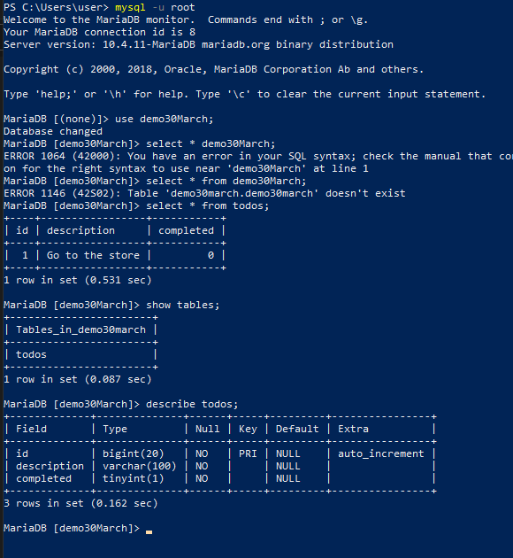

# Laracast Episode 5 
## Separation of concerns: 
	-You can think of concerns as responsibilities.
	-Have one section where you prepare your data. 
	-Another section where you render/display your data
    -We created a new file called `index.view.php` responsible for rendering data. `index.php` will responsible of receive data. 

# Laracast Episode 6
## Understanding Arrays:	
	-Creat array by assigning a value to a variable i.e $names = []; and within you can have any number of items. 
	-Then we loop the items in html element list. First method is shorthand method which makes your code cleaner. 

# Laracast Episode 7
## Associative Arrays:	
	-Here, each item has a key and when we point to the key, we can get it's value. 

```
$person = [
	'age' =>26,
	'color' =>'black',
];

```
	-We also learn a debug like method using die(var_dump('something to check')). 

# Laracast Episode 8
## Associative Arrays with Booleans:	
	-Casting out a boolean value(true/false) into html, we may not see anything(1) and we do, it doesn't make sense. 
	-Php will give you more control over the array, rather than filtering through the array, you can do it one at a time if you want to control of what the keys are. 
	-$task['completed'] is a boolean, therefore we can check if it's true or false then proceed to echo something in html that is more informative and understandable. We use ternary operator as a shorthand of if (){---} else {----}
	-Learnt php helper functions like ucwords(), strtoupper(). You can learn this functions by lot of reading or googling when the need arises in you coding career. 
# Laracast Episode 9
## More of conditions:
	-We have learned that sometimes using ternary operator to check condition may limit you in someway and you may need flexibility in making html elements. The trick here is to know when to use each. But the thumb rule is, if you want more flexibility, use traditional if condition checker. 

```
<?php if ($task['completed']): ?>
	<span class="icon">&#9989</span>
<?php else: ?>
	<span class="icon">Incomplete</span>
<?php endif; ?>

```	
	-How do we check if something is not true?
```
<?php
	if(! true) {---}
?>
```
# Laracast Episode 10
## Functions:
	-Reusable functions. Creating methods that you can call at any given point.
	-To save time and avoid repeating code that does the same thing. 
	-You can now call methods just like we were calling ready made php methods like ucwords(), htmlspecial(), etc.

# Laracast Episode 11
## MYSQL 101:	
	-Basic SQL queries using command line and GUI's. 
	

# Laracast Episode 12
## Classes 101:	
	-How do we define a class? 
	-A class can represent any possible thing in  your project. A blueprint.
	-When naming a class we use a Noun. e.g Person, Task, Student, etc. In regard to the context. 

```
<?php

class Person{
	//properties and methods

	public $name;
	public $age;
	public $career;

	//methods
	public function __construct($name, $age, $career){
		//automatically triggered on instantiation/initialization
		$this->name = $name;
		echo $this->name;
		$this->laugh();
	}
	public function laugh(){
		echo "Hahahaaa..";
	}
}
//instantiation
$person = new Person('John', '26', 'Web Developer');

```
	-With time as a Student of programming using any language, you will learn what classes are, how they communicate with each other and why we use them.